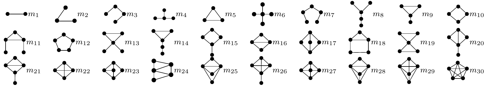

# On Analysing Graphs with Motif-Paths

This repository contains codes and datasets used in [On Analysing Graphs with Motif-Paths].

## Authors 

- Anonymous during paper review

## Dependencies.
* [JavaSE-1.8.](https://www.oracle.com/java/technologies/javase-jdk8-downloads.html)

## Datasets
The code takes the **edge list** of the graph. Every row indicates an edge between two nodes separated by a comma. The first row is a header. Nodes should be indexed starting with 1. The datasets used in the paper are included in the  `data/` directory.

* The three protein-protein interaction (PPI) networks are within folder `data/ppi/`, named `ppi-gavin` (GAVI in the paper), `ppi-kcore` (KCOR in the paper) and `ppi-kextend` (EXTE in the paper). In each file, each line (except the first line) denotes an edge. The ground-truth communities are `ppi-gavin.gt`, `ppi-kcore.gt` and `ppi-kextend.gt` repectively, in which a line denotes a ground-truth community.
* The two social networks are within folder `data/social/`, named `dblp` (DBLP in the paper) and `amazon` (AMAZ in the paper). The format is same as ppi networks. The ground-truth communities are `dblp.gt` and `amazon.gt` repectively. The subgraphs of DBLP for node ranking, DBLP-1 and DBLP-2 are also included, named `dblp1` and `dblp2`. The two files `dblp1.nodes` and `dblp2.nodes` decsribe the information of author_names and H-Index values, where each line is in the format `node_id	author_name	H-Index`.
* The synthetic networks are within folder `data/syn/`, named `s1`, `s2`, `s3`, `s4` and `s5`. The format is same as ppi networks. The format is same as ppi networks.
 
## Usage of Codes
The codes are included in the  `codes/` directory, which are compiled into `codes/mpath.jar` and provide the following command line arguments. Note that the basic usage is `java -jar codes/mpath.jar [option:value]`.

#### Motif-path options	`codes/mpath.jar`
```
-g	The path of the graph.				Default is `data/ppi/gavin`.
-m	The motif pattern:				Default is `5`.
	  The supported motif ID is in the figure below.
-s	The source node ID.				Default is `1`.
-t	The target node ID.				Default is `2`.
-d	The defragmentation manner:			Default is `0`.
	  0 for non-defragmentation,
	  1 for injecting bridging edges, 
	  2 for injecting motif-clique edges.	
```
<p align="center">
  
</p>

For example, the command `java -jar codes/mpath.jar -g:data/ppi/gavin -m:5 -d:1 -s:1 -t:100` will output a shortest motif-path between nodes (1,100) from AMAZ based on triangle and bridging-edge-based defragmentation. Both shortest motif-path and corresponding shortest motif-sequence will be outputed. Note that a traditional shortest path will be calculated by using `-m:1`.

#### Motif-graph defragmentation options	`codes/mpath.jar`
```             
-b	Calculate motif-components.
```
To run bridging-edge-based defragmentation `-d:1`, the motif-components should be calculated beforehand, e.g., `data/ppi/gavin-m5.mcom`, by running `java -jar codes/mpath.jar -b -m:5 -g:data/ppi/gavin`. A file named `data/ppi/gavin-m5.mcom` will be generated with a line recording the motif-component ID of each node.

Similarly, before running `-d:2`, you need to run the codes from [EdMot](https://github.com/benedekrozemberczki/EdMot), and get the enhanced motif-graph by adding `nx.write_edgelist(self.graph, "gavin.edmot")` into function `_fill_blocks` of `src/edmot.py`. [EdMot](https://github.com/benedekrozemberczki/EdMot) only supports triangle. A copy of `x.mcom` and `x.edmot` have been prepared in `data/` for each dataset `x`, except `data/social/dblp.edmot` and `data/social/amazon.edmot`, since EdMot cannot terminate in one day).

#### Motif-path based link prediction options	`codes/linkp.jar`
```
-g	The path of the graph.				Default is `data/ppi/gavin`.
-m	The motif pattern:				Default is `5`.
-d	The defragmentation manner:			Default is `0`.
	  0 for non-defragmentation,
	  1 for injecting bridging edges, 
	  2 for injecting motif-clique edges.	
-n	The number of iterations.			Default is `5000`.        
-t	The metric to be applied:			Default is `0`.   
	  0 for Graph Distance,
	  1 for Katz Index.	  
-q	Generate missing and nonexistent queries.
```
For example, the command `java -jar codes/linkp.jar -g:data/ppi/gavin -m:5 -t:1 -d:1` will output the triangle-path based link prediction results, with bridging-edge-based defragmentation and Katz Index as the link prediction metric.

To run motif-path based link prediction, the query nodes of missing-links (positive sampling) and nonexistent-links (negative sampling) should be sampled beforehand, e.g., `data/ppi/gavin.linkp`, by running `java -jar codes/linkp.jar -q -n:5000 -g:data/ppi/gavin`. A file named `data/ppi/gavin.linkp` will be generated where each line records the ID of missing-link nodes (the first and second number) and the ID of nonexistent-link nodes (the third and last number). Note that the missing-links and the nonexistent-links follow the same shortest path distance distribution. A copy of `x.linkp` for each dataset has been prepared in `data`.

#### Motif-path based local graph clustering options	`codes/localgc.jar`
```
-g	The path of the graph.				Default is `data/ppi/gavin`.
-m	The motif pattern:				Default is `5`.
-d	The defragmentation manner:			Default is `0`.
	  0 for non-defragmentation,
	  1 for injecting bridging edges, 
	  2 for injecting motif-clique edges.	
-n	The number of queries.				Default is `500`.        
-k	The value of k for NN search.			Default is `15`.
-s	The source node ID.				Default is `1`.	   
```
For example, the command `java -jar codes/localgc.jar -g:data/ppi/gavin -m:5 -d:1 -n:500 -k:100` will output the precision, recall and f1-score of triangle-path based local graph clustering, with bridging-edge-based defragmentation and the size of the cluster is fixed as 100. Note that the ground-truth communities should be put beside the graph, e.g., `data/ppi/gavin.pt`.

Also, you can see the members of the cluster by inputing a specific query node `s`, e.g., `java -jar codes/localgc.jar -g:data/ppi/gavin -m:5 -d:1 -k:100 -s:1`, which will output a local cluster around node `s`.

#### Motif-path based node ranking options	`codes/rank.jar`
```
-g	The path of the graph.				Default is `data/social/dblp1`.
-m	The motif pattern:				Default is `5`.
-d	The defragmentation manner:			Default is `0`.
	  0 for non-defragmentation,
	  1 for injecting bridging edges, 
	  2 for injecting motif-clique edges.	
-k	The value of k for NDCG calculation.		Default is `15`.
-b	Generate betweenness centrality scores for each node.
```
For example, the command `java -jar codes/rank.jar -g:data/social/dblp1 -m:5 -d:1 -k:15` will output the NECG score and top-15 nodes in the ranking list by motif-path based betweenness centrality, with bridging-edge-based defragmentation and triangle as the motif pattern. Note that the relevance scores (e.g., H-index values) of each node should be put beside the graph, e.g., `data/social/dblp1.nodes` and `data/social/dblp2.nodes`, where each line records the node ID, node name and its relevance score.

To run a motif-path based node ranking, the betweenness centrality for each node should be calculated beforehand, e.g., `data/social/dblp1.rank`, by running `java -jar codes/rank.jar -g:data/social/dblp1 -b -m:1`. A file named `data/social/dblp1.rank` will be generated where the first two lines record the nodes and their scores of the ideal ranking (e.g., H-index), and the last two lines record the nodes and their scores for the current ranking (e.g., betweenness centrality). A copy of `x.rank` for `data/social/dblp1` and `data/social/dblp2` has been prepared in `data/social/` for betweenness centrality based ranking (BET). Similarly, `x_m5.rank` is prepared for the ranking of motif-path based betweenness centrality without defragmentation (MBET); `x_m5_d1.rank` is prepared for the ranking of motif-path based betweenness centrality with bridging edge based defragmentation (MBET-b); `x_m5_d2.rank` is prepared for the ranking of motif-path based betweenness centrality with the defragmentation approach from Edmot (MBET-c). All these files can be generated by running `java -jar codes/rank.jar -g:data/social/x -b -m:[1 or 5] -d[0 or 1 or 2]` respectivelyly.  

## Competitors
In this section, we introduce the usage of the competitors. For the competitors with codes released, please refer the original introduction. For the competitors without codes released, we implemented them and integegrated them together with graph mining codes. Below please find their usages.
### Competitors with released codes
- [Motif-Aware Graph Clustering (Tectonic)](https://github.com/tsourolampis/tectonic) 
- [Local Higher-Order Graph Clustering (MAPPR)](http://snap.stanford.edu/mappr/)
- [Edge Enhancement Motif Clustering (EdMot)](https://github.com/benedekrozemberczki/EdMot) 
- [Motif PageRank based node ranking (MPR)](https://github.com/HKUST-KnowComp/Motif-based-PageRank) 
	- PageRank (PR) is integrated in MPR by setting `alpha_value = 1`. 
	- Weighted PageRank (WPR) is integrated in MPR by setting `alpha_value = 1` and remove line 216 of motif_construct_direct.py `adjacency_matrix.data = np.ones((1, lennn), dtype=np.float64)[0]`.

### Competitors implemented by us
We implement the following competitors and integegrate them into our codes. To demonstrate the usage, we show the parameters with dataset `data/ppi/gavin` for those in link prediction and dataset `data/social/dblp1` for the competitor in node ranking.

- Common Neighbors (CN)
```
java -jar codes/linkp.jar -g:data/ppi/gavin -o -n:5000
```
- Motif-based Common Neighbors (MCN)
```
java -jar codes/linkp.jar -g:data/ppi/gavin -c -n:5000
```
- Jaccard Coefficient (JC)
```
java -jar codes/linkp.jar -g:data/ppi/gavin -j -n:5000
```
- Adaminc/Adar (AA)
```
java -jar codes/linkp.jar -g:data/ppi/gavin -a -n:5000
```
- Preferential Attachment (PA)
```
java -jar codes/linkp.jar -g:data/ppi/gavin -p -n:5000
```
- Friends Measure (FM)
```
java -jar codes/linkp.jar -g:data/ppi/gavin -f -n:5000
```
- Hitting Time (HT)
```
java -jar codes/linkp.jar -g:data/ppi/gavin -h -n:5000
```
- Rooted PageRank (RPR)
```
java -jar codes/linkp.jar -g:data/ppi/gavin -r -n:5000
```
- Motif-based Link Prediction (MLP)
```
java -jar codes/linkp.jar -g:data/ppi/gavin -l -n:5000
```
After running the code, `gavin_posi_vec` and `gavin_nega_vec` will be generated, which record the motif based feature vectors of missing-links and nonexistent-links respectively. The feature vectors can be further usd for training and testing in different classifiers, e.g., `GradientBoostingRegressor` from `sklearn.ensemble` of python.
- Degree based Node Ranking (DEG)
```
java -jar codes/rank.jar -g:data/social/dblp1 -n -k:15
```